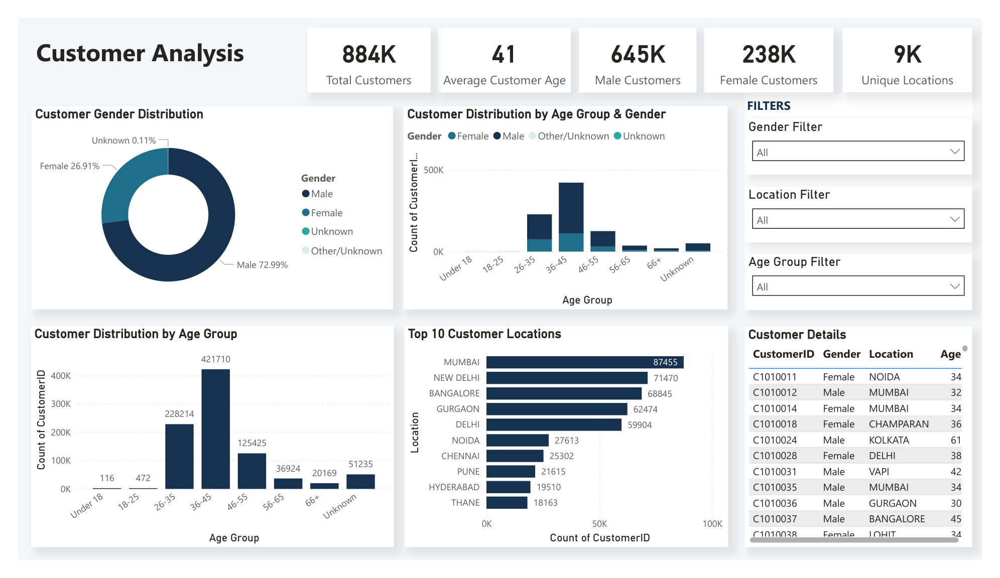
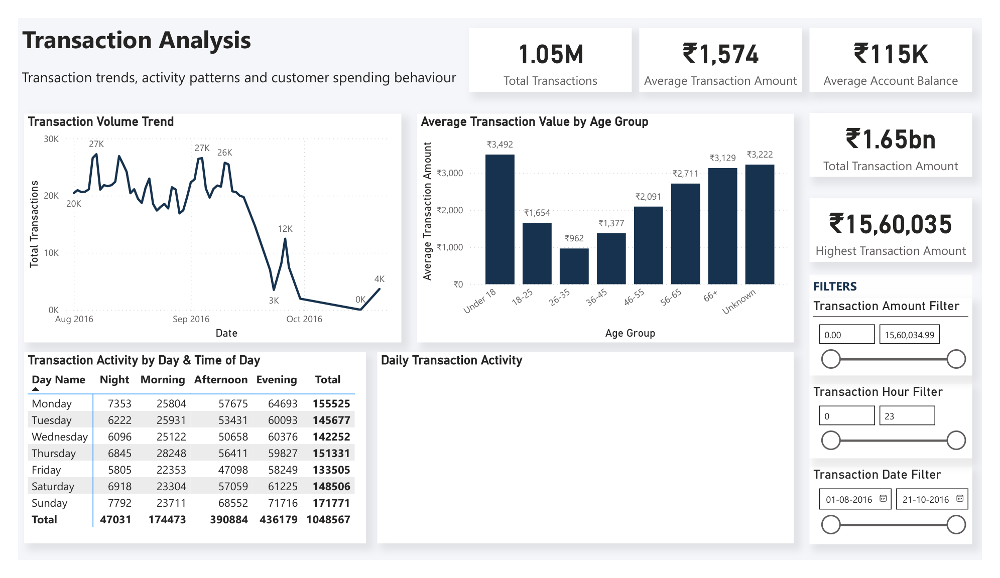
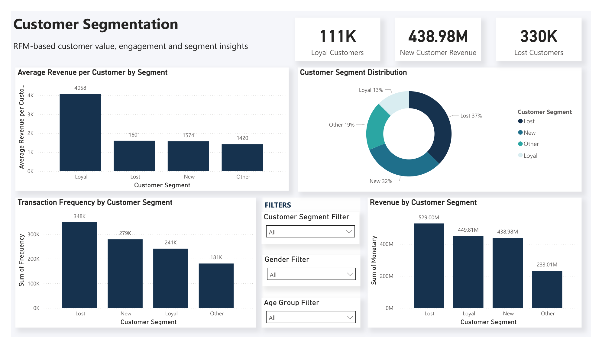
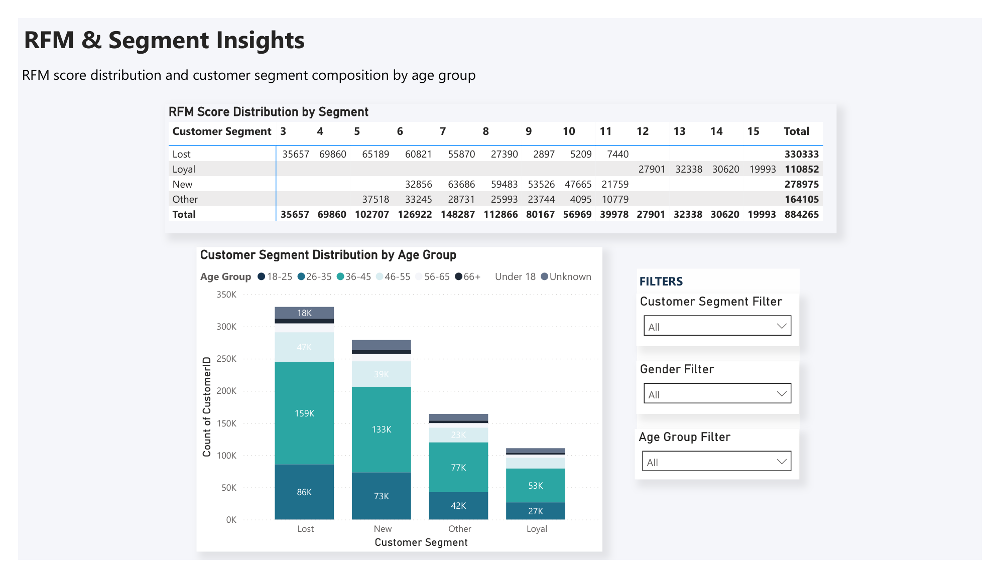
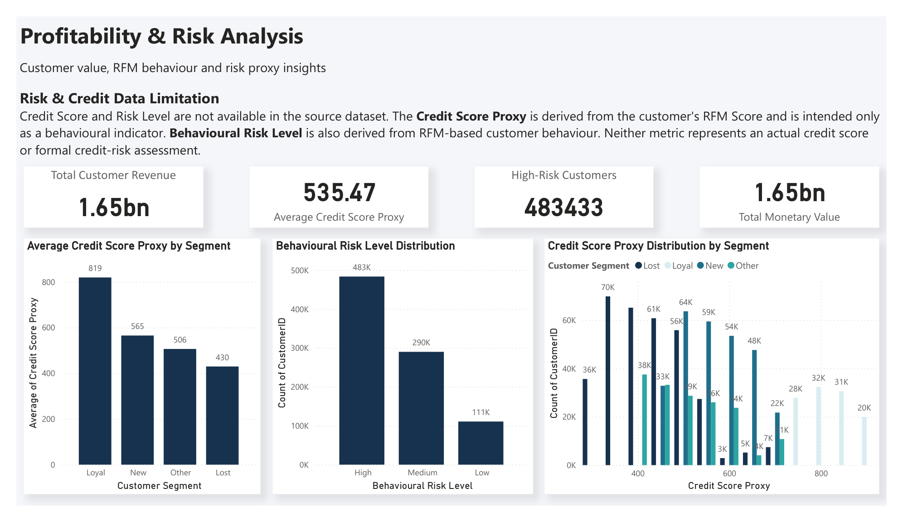
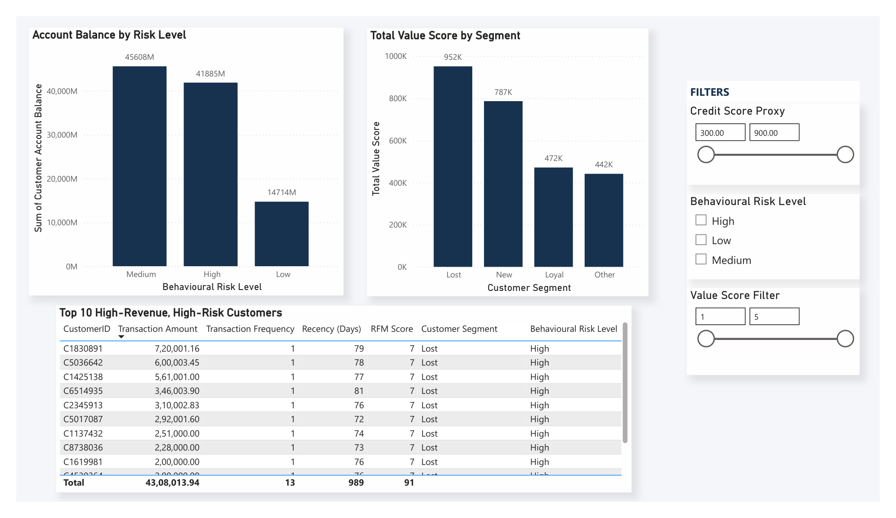

# Bank Customer Segmentation & Transaction Intelligence Dashboard

## 📊 Project Overview

An interactive Power BI dashboard designed to transform large-scale banking transaction data into actionable insights across customer demographics, transaction behavior, RFM-based customer segmentation, customer value, and behavioral risk indicators.

The project demonstrates an end-to-end data analytics workflow covering data cleaning, data modeling, DAX calculations, customer segmentation, interactive visualization, and business insight generation.

### 📸 Dashboard Preview













---

## 🎯 Problem Statement

Banks generate large volumes of customer and transaction data, but raw transaction records alone do not provide a clear view of customer demographics, spending behavior, customer value, or engagement patterns.

This project transforms raw banking transaction data into an interactive Power BI dashboard that enables analysis of customer demographics, transaction behavior, RFM-based customer segmentation, and behavioral value/risk indicators.

The objective is to provide a centralized analytical view that helps identify valuable customer segments, understand transaction patterns, evaluate customer engagement, and support data-driven customer management decisions.

---

## 💼 Business Objectives

- Analyze customer demographics by age, gender, and location.
- Understand transaction volume, transaction value, account balance, and transaction activity patterns.
- Segment customers using Recency, Frequency, and Monetary (RFM) analysis.
- Identify loyal, new, lost/inactive, and other customer segments.
- Compare customer value and transaction frequency across segments.
- Develop behavioral risk and value indicators from available RFM-based data.
- Provide interactive filters for customer-level and segment-level analysis.
- Build a professional, interactive, decision-oriented Power BI dashboard.

---

## 🗂️ Dataset

The dataset contains approximately:

- **1.05M+ transaction records**
- **884K+ unique customers**
- **9K+ customer locations**

### Key Fields

| Field | Description |
|---|---|
| TransactionID | Unique transaction identifier |
| CustomerID | Customer identifier |
| CustomerDOB | Customer date of birth |
| CustGender | Customer gender |
| CustLocation | Customer location |
| CustAccountBalance | Account balance recorded with the transaction |
| TransactionDate | Transaction date |
| TransactionTime | Transaction time |
| TransactionAmount (INR) | Transaction amount in Indian Rupees |

---

## 🧹 Data Preparation

Power Query was used for:

- Data type correction
- Transaction date conversion
- Transaction time conversion
- Customer DOB cleaning
- Two-digit year correction
- Invalid/placeholder DOB handling
- Gender standardization
- Customer-level deduplication
- Creation of a customer dimension
- Creation of a dedicated date dimension
- Creation of transaction hour and time-of-day attributes
- Chronological sorting of date attributes

---

## 🏗️ Data Model

The Power BI model consists of:

### DimCustomer
Customer-level demographic information.

### bank_transactions
Transaction-level banking records.

### DimDate
Dedicated date dimension for time-based analysis.

### Relationships

```text
DimCustomer
     │
     │ 1 → *
     ▼
bank_transactions
     ▲
     │ * ← 1
     │
DimDate

---

## 📊 Dashboard Pages

### 1. Customer Analysis
Analyzes customer demographics and distribution across:
- Total customers
- Average customer age
- Gender distribution
- Customer age groups
- Customer locations
- Gender distribution by age group
- Customer-level details
- Interactive age, gender, and location filters

### 2. Transaction Analysis
Provides transaction behavior and activity insights:
- Total transaction volume
- Average transaction amount
- Highest transaction value
- Average account balance
- Transaction volume trends
- Average transaction value by age group
- Transaction activity by day and time of day
- Daily transaction activity
- Interactive date, hour, and transaction amount filters

### 3. Customer Segmentation
Uses RFM-based segmentation to analyze:
- Loyal customers
- New customer revenue
- Lost/inactive customers
- Customer segment distribution
- Average revenue per customer
- Revenue by segment
- Transaction frequency by segment

### 4. RFM & Segment Insights
Provides deeper customer segmentation analysis through:
- RFM score distribution by segment
- Customer segment distribution across age groups
- Segment, gender, and age-group filtering

### 5. Profitability & Risk Analysis
Analyzes customer value and behavioral risk indicators:
- Total customer revenue
- Average Credit Score Proxy
- High behavioral risk customers
- Total monetary value
- Average Credit Score Proxy by segment
- Behavioral risk distribution
- Credit Score Proxy distribution by segment

### 6. Profitability & Risk Analysis — Customer Details
Provides deeper customer-level analysis through:
- Account balance by behavioral risk level
- Total value score by segment
- Top 10 high-revenue, high-risk customers
- Credit Score Proxy filtering
- Behavioral Risk Level filtering
- Monetary Score filtering

---

## 🧠 RFM Methodology

Customer segmentation is based on three RFM dimensions:

| Dimension | Meaning | Interpretation |
|---|---|---|
| Recency | Days since the customer's last observed transaction | Lower recency indicates more recent activity |
| Frequency | Number of transactions | Higher frequency indicates stronger engagement |
| Monetary | Total transaction amount | Higher monetary value indicates greater customer value |

Each RFM component is scored from **1 to 5** using percentile-based thresholds.

The combined RFM Score ranges from **3 to 15** and is used to classify customers into behavioral segments such as:

- **Loyal**
- **New**
- **Lost**
- **Other**

The "Lost" segment represents customers who appear inactive relative to the observed transaction period and should not be interpreted as confirmed permanent churn.

---

## ⚠️ Risk & Credit Data Limitation

The source dataset does not contain an actual credit score, formal risk level, or value score.

Therefore, the dashboard uses derived behavioral indicators:

- **Credit Score Proxy** — derived from the customer's RFM Score and mapped to a 300–900 scale for analytical comparison.
- **Behavioral Risk Score** — derived inversely from the RFM Score.
- **Behavioral Risk Level** — classified as Low, Medium, or High based on the behavioral risk score.
- **Value Score** — represented using the Monetary Score component of the RFM framework.

These are **analytical proxies only** and should not be interpreted as actual credit-risk assessments or financial credit scores.
